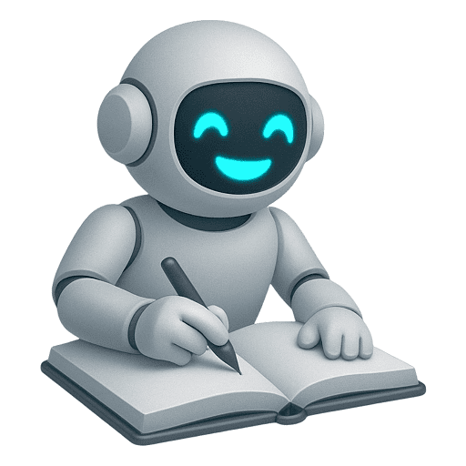

  
  <h1>Prompt Engineering Studio</h1>
  
Cara Mudah Membuat Prompt Profesional untuk Gambar, Video, dan Lagu

---

Selamat datang di **Prompt Engineering Studio**! Aplikasi ini adalah teman terbaik Anda untuk belajar dan merancang _prompt_ (perintah) untuk berbagai model AI generatif. Baik Anda seorang profesional kreatif, pemasar, atau sekadar penasaran, studio ini dirancang untuk mempermudah proses pembuatan prompt yang efektif dan berkualitas tinggi.

## ✨ Fitur Utama

- **📖 Panduan Prompt Lengkap:** Belajar dari dasar hingga mahir dengan panduan komprehensif yang mencakup rekayasa prompt untuk:
  - **Gambar (Nano Banana/Gemini):** Kuasai teknik membuat gambar fotorealistis, logo, mockup, hingga karakter yang konsisten.
  - **Video (Veo3):** Pelajari cara mengarahkan AI untuk membuat video sinematik lengkap dengan kontrol kamera dan audio.
  - **Lagu (SUNO AI):** Pahami cara menulis lirik terstruktur dan mendeskripsikan gaya musik untuk menciptakan lagu yang sempurna.

- **🎨 Desainer Prompt Intuitif:** Tidak perlu lagi bingung memulai dari mana. Cukup isi formulir sederhana, dan biarkan aplikasi yang merancang prompt profesional untuk Anda. Desainer kami mencakup:
  - **Desainer Gambar:** Untuk kebutuhan fotografi produk, desain kemasan, aset pemasaran, logo, dan ilustrasi.
  - **Desainer Video:** Rancang adegan video dengan detail subjek, aksi, latar, gaya sinematik, hingga audio.
  - **Desainer Lagu:** Ciptakan lagu berdasarkan tema, bahasa, vokalis, dan genre musik yang Anda inginkan.

- **🤖 Asisten AI Cerdas:** Punya pertanyaan tentang prompt? Asisten AI kami yang didukung oleh Gemini siap membantu Anda dengan cepat dan akurat.

- **💡 Penyempurnaan Prompt Otomatis:** Dengan sekali klik, tingkatkan prompt dasar Anda menjadi prompt yang lebih kaya, deskriptif, dan profesional menggunakan kekuatan AI.

- **🖼️ Analisis Gambar Cerdas:** Unggah gambar referensi, dan biarkan AI menganalisisnya untuk membantu Anda membuat prompt pengeditan atau pembuatan karakter dengan lebih cepat.

- **🌗 Mode Terang & Gelap:** Bekerja dengan nyaman kapan saja dengan pilihan tema yang dapat disesuaikan.

## 🚀 Cara Penggunaan

Menggunakan Prompt Studio sangat mudah. Ikuti langkah-langkah berikut:

### 1. Memulai Aplikasi

Saat pertama kali membuka aplikasi, Anda akan disambut dengan layar selamat datang yang memberikan dua pilihan:

- **Lingkungan Gemini:** (Direkomendasikan) Opsi ini akan membuka tab baru ke lingkungan bersama di mana Anda bisa langsung mencoba aplikasi tanpa perlu API Key.
- **Gunakan kode API Gemini:** Jika Anda memiliki API Key Google Gemini sendiri, pilih opsi ini.
  - **Dapatkan API Key:** Jika belum punya, klik tautan ke **Google AI Studio** di halaman tersebut dan buat API Key gratis.
  - **Masukkan API Key:** Masukkan kunci Anda ke dalam kolom yang tersedia dan klik "Mulai Studio".

### 2. Navigasi Utama

Setelah masuk ke aplikasi utama, ada dua tab utama:

- **Panduan Prompt:** Di sini Anda akan menemukan semua materi pembelajaran. Klik daftar isi untuk langsung melompat ke materi yang ingin Anda pelajari.
- **Desainer Prompt:** Di sinilah Anda akan merancang prompt Anda.

### 3. Menggunakan Desainer Prompt

1.  **Pilih Tipe Output:** Klik tab **Gambar (Nano Banana)**, **Video (Veo3)**, atau **Lagu (SUNO)** sesuai kebutuhan Anda.
2.  **Isi Formulir:**
    - Untuk **Gambar** dan **Video**, isi detail seperti subjek, gaya, latar belakang, dan informasi relevan lainnya. Anda juga bisa mengunggah gambar referensi.
    - Untuk **Lagu**, masukkan tema, pilih bahasa, vokalis, dan genre.
3.  **Hasilkan Prompt:**
    - Untuk **Gambar** dan **Video**, prompt akan secara otomatis dibuat di kotak "Hasil Prompt" saat Anda mengisi formulir.
    - Untuk **Lagu**, klik tombol "Buat Prompt Lagu" untuk menghasilkan lirik, gaya, dan judul.
4.  **(Opsional) Sempurnakan dengan AI:** Klik tombol **"Sempurnakan Prompt"** untuk membuat prompt Anda lebih detail secara otomatis.
5.  **Salin Prompt Anda:** Klik tombol **"Salin"** untuk menyalin prompt yang sudah jadi dan gunakan di platform AI favorit Anda!

---

Dibuat dengan ❤️ oleh ISPARMO. Didukung oleh teknologi AI.
